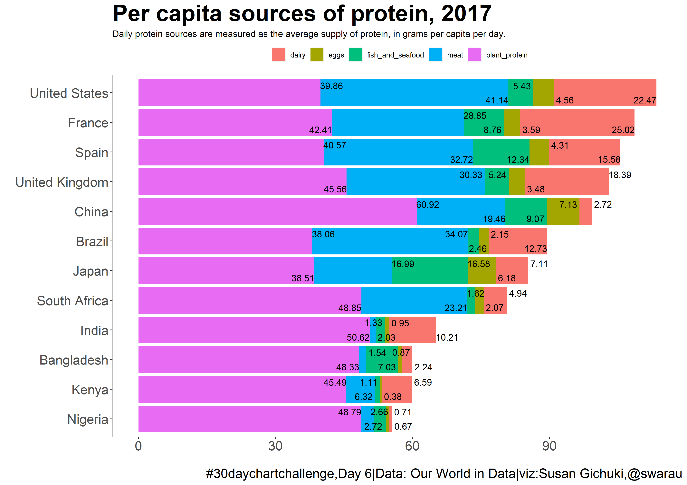
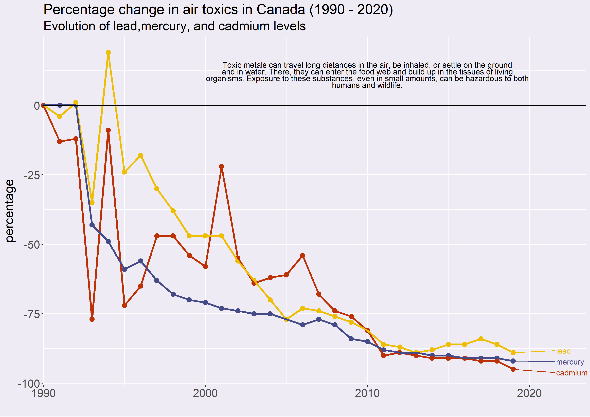
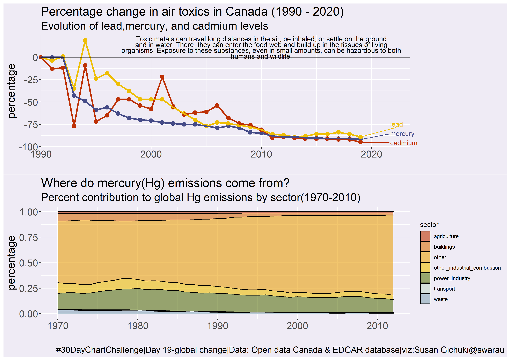

# 30daychartchallenge

## Day 6 - Our World In Data - OWID 

## Day 19 - Time series category - Global Change 

The plot above combined with another plot showing the contribution from different sectors to global mercury emissions.
The data is from the EDGAR database of the European Union. 

